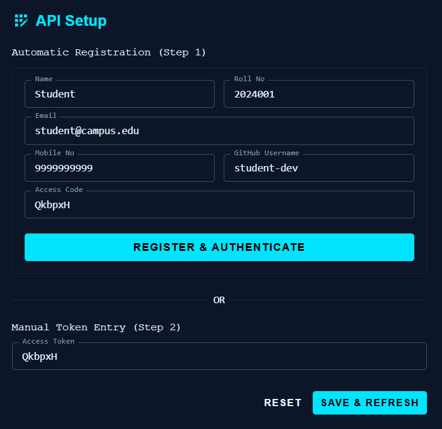
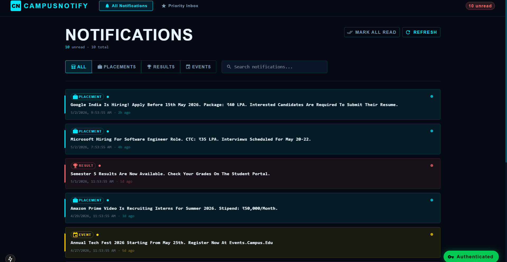
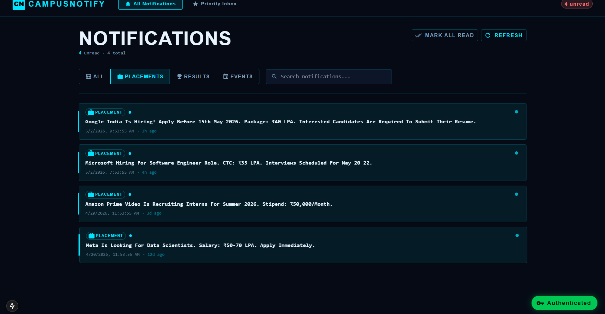
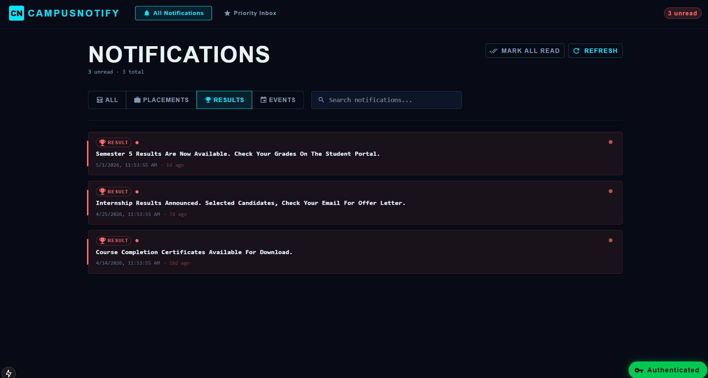
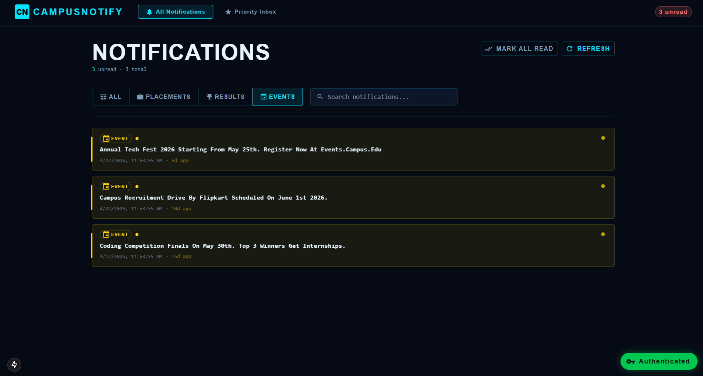

# Campus Notification System

A premium, cyberpunk-themed notification management system built with **Next.js 15**, **Material UI 6**, and **TypeScript**. This system features a priority-based inbox that intelligently ranks notifications based on their importance and recency.

## 🚀 Features

- **Intelligent Priority Algorithm**: Automatically ranks notifications (Placements > Results > Events).
- **Secure API Proxy**: Custom backend proxy to handle CORS and Authorization securely.
- **Categorized Views**: Dedicated filters for Placements, Results, and Events.
- **Automated Authentication**: Integrated AuthManager for easy registration and token management.
- **Modern UI**: Cyberpunk dark mode with glassmorphism effects.

## 📸 Screenshots

### 1. API Setup & Authentication
The system handles automated registration and authentication with the external campus service.


### 2. Main Notifications Dashboard
The main dashboard displays all notifications with real-time "time-ago" updates.


### 3. Categorized Filters
Users can quickly filter through different types of campus updates.




## 🧠 Priority Algorithm

The system uses a weighted scoring mechanism to determine the "Top 10" priority notifications:

1.  **Weighting**:
    -   **Placements**: Weight 3 (Critical)
    -   **Results**: Weight 2 (High)
    -   **Events**: Weight 1 (Normal)
2.  **Recency**: Secondary sorting is applied using the timestamp to ensure the newest important notifications are always at the top.
3.  **Calculation**: `Score = (Weight * 1000) + (Recency_Factor)`

## 🛠️ Installation & Setup

1.  **Navigate to the frontend folder**:
    ```bash
    cd notification_app_fe
    ```

2.  **Install dependencies**:
    ```bash
    npm install
    ```

3.  **Run the development server**:
    ```bash
    npm run dev
    ```

4.  **Access the application**:
    Open [http://localhost:3000](http://localhost:3000) in your browser.

## 📂 Project Structure

- `logging_middleware/`: Centralized logging service.
- `notification_app_fe/`: Next.js frontend application.
- `notification_app_be/`: Placeholder for future backend extensions.
- `notification_system_design.md`: Technical architecture and design report.
- `priority_inbox.ts`: Standalone Stage 1 algorithm proof.

## 🎓 Author
**Roll Number**: AP23110011220
